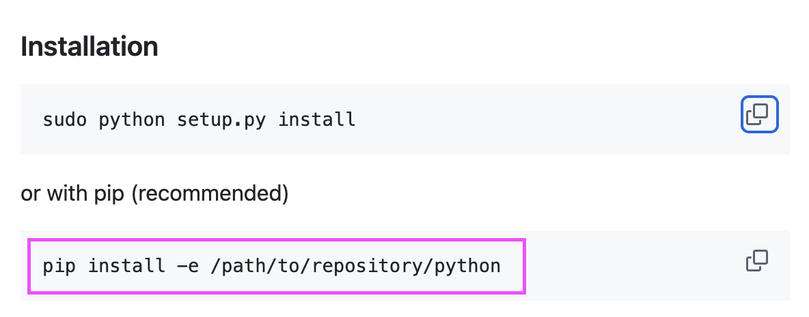

# project_one

flight tracker and flight delay predictor

## API

[kaggle](https://www.kaggle.com/datasets/mahoora00135/flights)

[opensky api](https://github.com/openskynetwork/opensky-api)

## Installing project dependencies

All the required dependencies are located in the [requirements.txt](requirements.txt) file.

Open your built in terminal (vscode terminal can be hotkey opened with ```control + tilde``` for OSX and ```Ctrl + (backtick)``` for Windows)). Make sure you in the root of your project then run ```pip install -r requirements.txt```.

## Downloading flights data from [Kaggle](https://www.kaggle.com) (NOTE: DO NOT REPEAT. DATA IS ALREADY IN PROJECT) [flights](data/flights.csv)

First you'll need to make a free [Kaggle account](https://www.kaggle.com/account/login?phase=startRegisterTab&returnUrl=%2Fdatasets%2Fmahoora00135%2Fflights).

Once you have created an account click on your profile image and select 'settings'. Once there you will see a section for API. Go ahead and create a new API key by clicking 'Create New Token'. This will start the which will contain your username and api key.

Place the kaggle json in a .env file to protect you access credentials. (this is only to keep your username and password somewhere that you can access it easily but not be added to the repo. The .env file will have no effect on the kaggle api.)

You will also need to copy the downloaded json from kaggle into this project. DO NOT change the file name as it is already added to .gitignore and we don't want that file making it to github.

With the kaggle.json placed in the root of this project we need to set the permissions by using ```chmod 600 kaggle/kaggle.json``` in you terminal (vscode terminal can be hotkey opened with ```control + tilde``` for OSX and ```Ctrl + (backtick``` for Windows)).

```chmod``` is a unix/linux/osx command for changing file permissions. It can also be used in Windows WSL. ```600``` is the permission settings. ```6``` refers to the file own (you) giving permission to **read and write**. ```00``` denies permission for other users. ```kaggle/kaggle.json``` is the file where the permission will take effect.

Now you should be and to run ```kaggle datasets download -d mahoora00135/flights``` to download the flights.zip.
Once the zip has been downloaded you will need to unzip the file and place the csv file in the data folder.

## Installing OpenSkyApi


Run ```pip install -e src/python3/python``` **if there is an error with using python3 then just use python/python instead both python 2 & 3 are compatible**

## Deployment flow

When starting a new task it is always best to work in a new branch
**if not on main branch**
```git switch main```
```git pull origin main```
```git checkout -b <branch-name>```

Make sure to commit and push often
```git status```
```git add .```
```git commit -m 'commit message'```
```git push```
**if it is the first time pushing your branch to the remote repo use**
```git push --set-upstream origin <branch-name>```

## Branch Discipline

There are two branch that will contain all contributors work.
Those are ```stage``` and ```main```. ```main``` is the Sacred branch.
```main``` can not be pushed to by any branch. Project manager will handle
updating ```main```. ```stage``` can be updated by any branch but needs at least 2 people
to review the merge request before it can be approved. ```stage``` will serve at the
testing ground for contributor code additions. If and when ```stage``` is free of
conflict it will then be merged into main
