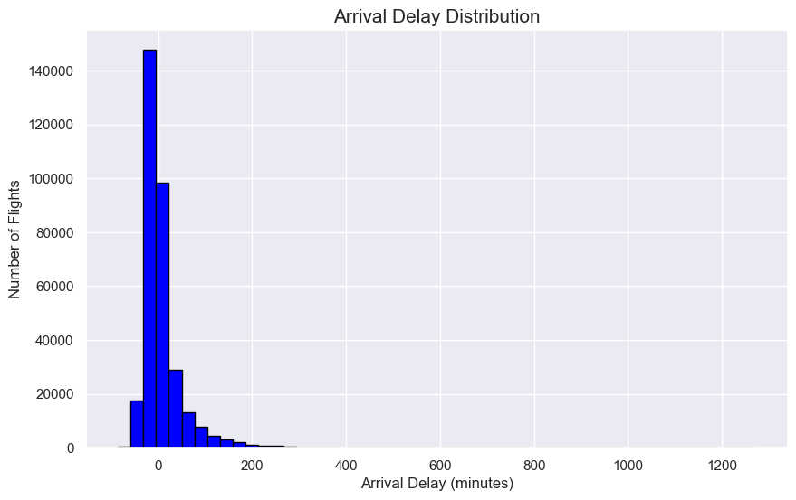
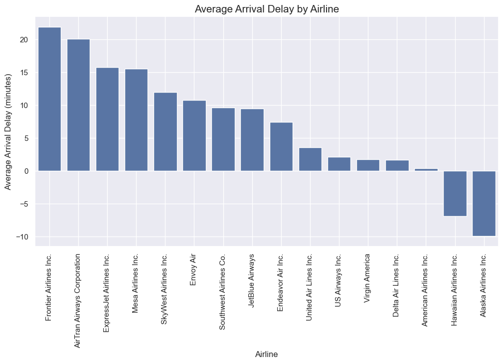
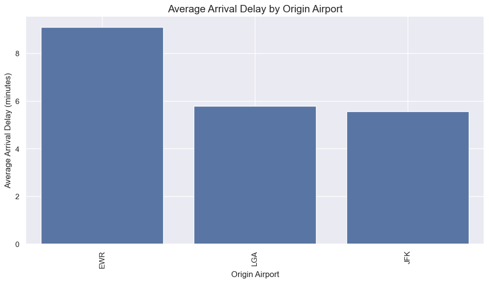
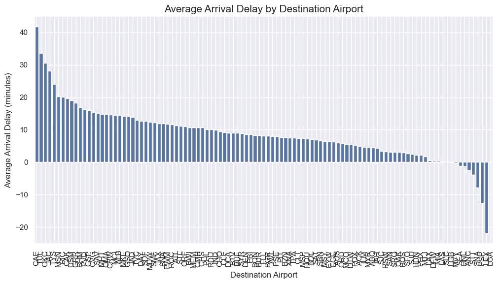
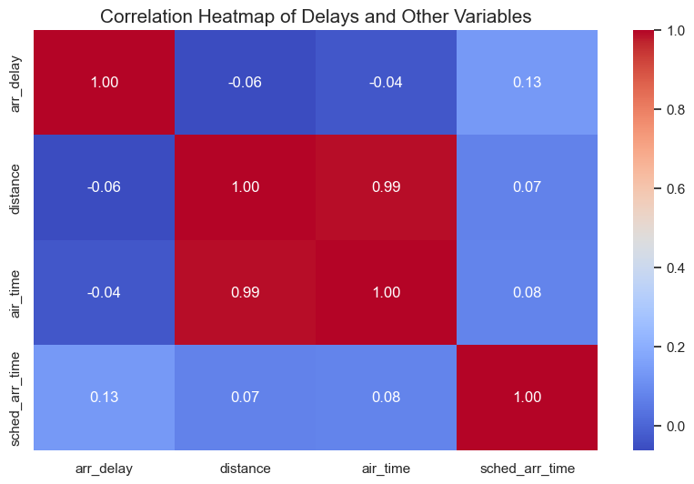
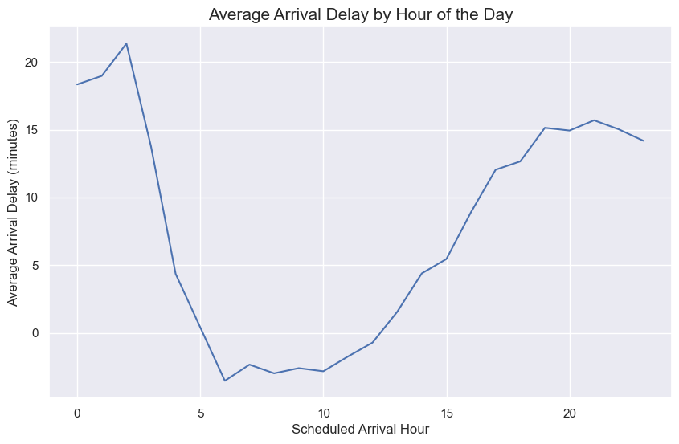
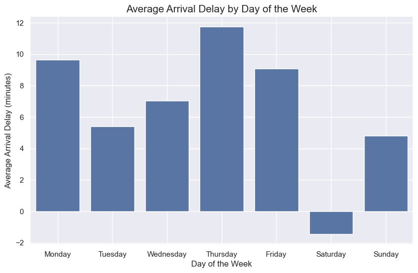

# Project 1: Analyzing Flight Behavior Patterns

<div style="text-align: center;">
    
</div>

---

## Table of Contents

- [Project Overview](#project-overview)
- [Objectives](#objectives)
- [Data Sources](#data-sources)
- [Quickstart Guide](#quickstart-guide)
- [Tech Stack Setup](#tech-stack-setup)
- [Exploratory Data Analysis (EDA)](#exploratory-data-analysis-eda)
- [Interactive Map Features](#interactive-map-features)
- [Results and Insights](#results-and-insights)
- [Conclusion](#conclusion)
- [How to Use](#how-to-use)
- [References and Credits](#references-and-credits)
- [Deployment Workflow](#deployment-workflow)
- [Branch Discipline](#branch-discipline)
- [Team Members](#team-members)
- [Acknowledgments](#acknowledgments)

---

## Project Overview

This project is part of an AI boot camp that focuses on advanced data analysis. We explore and analyze flight behavior patterns, with a primary focus on uncovering trends related to flight delays. Using datasets from Kaggle and the OpenSky API, our objective is to identify significant patterns and correlations that can help airlines and stakeholders make informed decisions.

Through this analysis, we develop insights that highlight trends and anomalies in flight behavior, such as delays by airlines, airports, and time of day. This project serves as a practical application of our data analysis skills, demonstrating the techniques and methodologies we have learned throughout the AI boot camp.

---

## Objectives

- Analyze overall flight delay distribution to understand delay trends.
Examine delays by airlines and airports to identify underperforming entities.
- Investigate delays by time of day and day of the week to pinpoint peak delay periods.
- Perform correlation analysis to explore relationships between flight delays and factors such as distance and flight time.
- Provide actionable insights and recommendations for airlines and airports to optimize operations and reduce delays.

---

## Data Sources 

### Kaggle Flight Data
- [Kaggle Dataset](https://www.kaggle.com/datasets/mahoora00135/flights) The dataset from Kaggle includes historical flight data with over 1 million records. Key columns include:

| Column         | Description                                                  |
|----------------|--------------------------------------------------------------|
| `id`           | Unique flight identifier                                     |
| `dep_time`     | Actual departure time (24-hour format)                       |
| `arr_time`     | Actual arrival time (24-hour format)                         |
| `dep_delay`    | Departure delay in minutes                                   |
| `arr_delay`    | Arrival delay in minutes                                     |
| `carrier`      | Two-letter airline carrier code                              |
| `origin`       | Origin airport code                                          |
| `dest`         | Destination airport code                                     |
| `distance`     | Distance traveled (miles)                                    |
| `air_time`     | Total time in the air (minutes)

### OpenSky API Data
- [OpenSky API](https://github.com/openskynetwork/opensky-api) The OpenSky API provides real-time flight tracking. This data can be used to compare with historical data to enhance predictions or validate findings.

---

## Quickstart Guide

### 1. **Install Project Dependencies**

**All required dependencies are stored in [requirements.txt](requirements.txt)**

- Open the terminal (VS Code terminal shortcut: macOS `Control + tilde` | Windows `Ctrl + backtick`).
- Ensure you are in the project root directory, then run:

     ```bash
     pip install -r requirements.txt
     ```

### 2. **Download Flight Data from Kaggle**

   **(Note: Data is already included; skip unless necessary.)**  

- Steps to download the data:
     1. Create a free [Kaggle account](https://www.kaggle.com/account/login).
     2. In Kaggle's settings, generate an API key and download `kaggle.json`.
     3. Copy `kaggle.json` to the project root and set permissions (Linux/macOS/WSL):

        ```bash
        chmod 600 kaggle/kaggle.json
        ```

     4. Download the dataset:

        ```bash
        kaggle datasets download -d mahoora00135/flights
        ```

     5. Unzip and move the `flights.csv` file to the `data` folder.

### 3. **Install OpenSky API**

**(Optional: Use the OpenSky API if additional features are needed after completing tasks with the Kaggle data.)**

- Install OpenSky API dependencies:

     ```bash
     pip install src/python3/python
     ```

- If you encounter issues with `python3`, use `python`.

---

## Tech Stack Setup

This project utilizes a dynamic tech stack to run the web application and generate interactive maps in real-time. Here’s a breakdown of the stack:

- **Flask:** The backend web framework handling routing and server-side logic.
- **Folium:** For dynamic map creation, allowing us to visualize flight paths and data on the map.
- **Pyodide:** Runs Python code directly in the browser, enabling client-side execution for future expansion.
- **Jinja2 Templating:** Used in Flask for rendering dynamic content on the web pages.
- **DigitalOcean Droplet:** Our deployment platform, providing a serverless experience for running the Python project.
- **Gunicorn:** A WSGI HTTP server used to serve the Flask application in production.

## Exploratory Data Analysis (EDA)

In this section, we present statistical summaries and visualizations derived from the flight behavior data. These insights help us understand key performance indicators related to flight operations.

### Key Insights from Flight Data

- **Overall Delay Trends:** Most flights experience minimal delays, but certain airlines and airports show consistently higher delays.
- **Airline Performance:** Frontier Airlines and AirTran Airways were identified as underperforming in terms of on-time arrivals, while Alaska Airlines consistently arrives early.
- **Airport Efficiency:** Newark Liberty International Airport (EWR) had the highest average delays, while smaller regional airports tended to perform better.
- **Time-Based Delays:** Flights scheduled during late-night hours (12 AM to 3 AM) and afternoon peak times (5 PM to 7 PM) were more likely to be delayed.
- **Correlation Findings:** Distance and flight time showed weak correlations with delays, indicating that other factors (such as weather or operational inefficiencies) are likely contributing to delays.

## Visualizations

### Visualization 1: **Arrival Delay Distribution**


**Explanation**: This histogram visualizes the distribution of arrival delays. The majority of flights experience delays ranging from 0 to 10 minutes. However, the right skew shows that there are some extreme outliers with significant delays, though they are less frequent.

---

### Visualization 2: **Average Delays by Airline**


**Explanation**: This bar chart shows the average delay times for each airline. Airlines like Frontier and AirTran tend to have longer delays on average, while Alaska Airlines stands out with consistently shorter delays. These differences suggest potential operational inefficiencies in certain airlines.

---

### Visualization 3: **Delays by Origin Airport**


**Explanation**: This bar chart analyzes delays based on the originating airport. Newark Liberty International Airport (EWR) has the longest delays, while smaller airports tend to have shorter delays. This could be due to larger airports dealing with more air traffic and congestion.

---

### Visualization 4: **Delays by Destination Airport**


**Explanation**: Similar to origin airports, this chart highlights destination airports with significant delays. Newark (EWR) once again stands out as one of the most delay-prone airports. This indicates that both departure and arrival at busy airports can contribute to flight delays.

---

### Visualization 5: **Correlation Between Delays and Other Variables (Heatmap)**


**Explanation**: This heatmap shows the correlation between various flight characteristics (such as distance, flight time, and delays). While there is a weak positive correlation between flight distance and delays, other variables like flight time show minimal correlation with delay times.

---

### Visualization 6: **Delays by Hour of the Day**


**Explanation**: This time-series chart shows how delays vary throughout the day. Early morning flights have the fewest delays, while late afternoon and night flights tend to face higher delays. This suggests that congestion builds up over the course of the day, leading to more delays later on.

---

### Visualization 7: **Delays by Day of the Week**


**Explanation**: This bar chart reveals how delays differ across the days of the week. Thursday experiences the highest delays, possibly due to higher traffic volume, while weekends tend to have fewer delays overall.


- **Recommendation:** 

1. **Operational Improvements for Airlines**: 
   - Airlines with consistently high delays, such as Frontier and AirTran Airways, should consider reviewing their scheduling and resource allocation strategies to reduce delays. Improving staff scheduling and aircraft turnaround times may help alleviate delays.

2. **Airport Congestion Management**:
   - Newark Liberty International Airport (EWR) faces significant delays. Airport management should consider implementing congestion management strategies, such as optimizing runway schedules or improving coordination between airlines to reduce bottlenecks.

3. **Focus on Late-Night Flights**:
   - Given that late-night flights experience higher delays, airlines and airports should allocate additional resources during these peak periods to handle potential issues before they escalate.

4. **Increased Resources During Busy Travel Days**:
   - Since Thursdays consistently show higher delays, airports should consider increasing staffing or resources during peak travel days to handle higher traffic volumes and minimize delays.

---

## Interactive Map Features 

The project includes an interactive map that dynamically displays flight paths and other flight data. The map is generated using Folium and Flask, allowing users to explore different aspects of the dataset.

### **Features:**

1. **Dynamic Map Creation:**
- Maps are generated dynamically on-demand based on flight data from the flight_states.csv file.
- The map renders flight paths and uses markers and polylines to represent flight categories and paths.
- Flight markers are color-coded based on aircraft categories.

2. **Routes in Flask:**
- **/:** Home page where users can run Python code via Pyodide.
- **/all_crafts:** Generates a map of all tracked flights and renders it dynamically on a separate HTML page.
- **/icao24_flight_path:** Generates specific flight paths using Folium and the flight's icao24 code.

3. **Deployment:**
- The web app is deployed on a DigitalOcean Droplet, allowing for a serverless experience. All code is run through Flask, served via Gunicorn, and dynamically renders the maps without any hardcoded HTML.

4. **Real-Time Data Handling:**
- The app dynamically reads flight data (from CSV) and feeds it into the map to reflect real-time or pre-recorded flight paths.

5. **Automation:**
- A script automatically converts Jupyter notebooks (.ipynb) to Python scripts (.py), allowing for seamless integration with the Flask app. The script can be found at notebooks/scripts/ipynb_script_converter.py.

---

## Results and Insights

- **Overall Delay Trends**: The majority of flights experience minimal delays, though extreme delays (outliers) can heavily influence the average delay time.
- **Airline Performance**: Airlines such as Frontier and AirTran Airways show consistently higher delays, while Alaska Airlines performs better with significantly fewer delays.
- **Airport Efficiency**: Larger airports like Newark Liberty International (EWR) experience the most delays, while smaller regional airports tend to perform better.
- **Time-Based Delays**: Early morning flights are generally on time, while late-night flights and weekday flights (especially Thursdays) face higher delays.
- **Correlation Analysis**: Weak correlations between delays and variables such as flight distance and air time suggest that other factors (e.g., operational inefficiencies or weather conditions) are more likely contributors to delays.

---

## Conclusion

This exploratory data analysis of flight delays has provided valuable insights into the factors contributing to delays. While many flights experience only minimal delays, certain airlines and airports consistently underperform. Larger airports like Newark Liberty (EWR) and airlines such as Frontier and AirTran Airways show significant opportunities for operational improvements.

Further research could incorporate external factors, such as weather conditions or seasonal trends, to provide a more comprehensive understanding of delay causes. By implementing the recommendations derived from this analysis, airlines and airports can work toward reducing delays, improving operational efficiency, and enhancing customer satisfaction.

### Future Work:

- **Incorporating Weather Data**: Adding weather data could help better explain delays related to specific environmental factors.
- **Seasonal Trends**: Analyzing data across different seasons or holidays could reveal additional trends in flight delays.
- **Predictive Modeling**: Building a predictive model to forecast delays based on the findings from this analysis could further optimize airline and airport operations.

---

## How to Use

1. **Download Flight Data:** The dataset is available in the `data/` folder. You can also download the latest data from Kaggle as mentioned in the [Quickstart Guide](#quickstart-guide).

2. **Run the Jupyter Notebook:** Navigate to the `notebooks/` folder and open `flight_analysis.ipynb`. The notebook includes all code and explanations for the data analysis.

3. Run the Interactive Map: Use the command below to start a local server and view the interactive map:
     ```bash
     python3 -m http.server
     ```
     - Then, access the map via http://localhost:8000/maps_html/.
     - **View the Deployed Web App:** Visit the deployed version of the project, including the interactive map, at:
          - **DigitalOcean Droplet URL:** http://143.198.183.206/

5. **View Visualizations:** All visualizations generated from the analysis are saved in the `images/` folder. You can review these to explore key trends insights from the data. 

6. **Explore Additional Datasets:** If you want to work with other data sets, place them in the `data/` folder and modify the correspinding parts of the notebook and scripts to analyze the new data. 

7. **Modify and Run the Scripts:** You can also modify the Python scripts and re-run them using the command:
     ```bash
     python <script_name.py>
     ```
     - For example, to re-run a mao generation script: 
     ``` bash
     python notebooks/scripts/ipynb_script_converter.py
     ```

## References and Credits

- [Pandas Documentation](https://pandas.pydata.org/)
- [Matplotlib Documentation](https://matplotlib.org/)
- [Folium Documentation](https://python-visualization.github.io/folium/)
- [Flask Documentation](https://flask.palletsprojects.com/)
- [Pyodide Documentation](https://pyodide.org/en/stable/)
- [Gunicorn Documentation](https://gunicorn.org/)
- [OpenSky Network API](https://openskynetwork.github.io/opensky-api/)
- [Kaggle Dataset](https://www.kaggle.com/datasets/mahoora00135/flights)

---

## Deployment Workflow

### 1. **Branching and Git Commands**

- **Create a new branch for each task**:
  - Before starting a new feature or task, create a new branch.
  
     ```bash
     git checkout -b <branch-name>
     ```

- **If not on `main`, switch to it**:
  - Ensure you are working from the latest version of the main branch.

     ```bash
     git switch main
     git pull origin main
     ```

- **Commit and push frequently**:
  - Always commit frequently and push your changes to avoid losing progress.

     ```bash
     git status
     git add .
     git commit -m 'commit message'
     git push origin <branch-name>
     ```

- **For the first push of a new branch**:
  - If it's your first push to a new branch, set the upstream reference.

     ```bash
     git push --set-upstream origin <branch-name>
     ```

---

### 2. **Merging Branches**

- **Ensure your branch is up to date**:
  - Before merging into `main`, ensure your feature branch is up to date with the latest changes from `main`.

     ```bash
     git checkout <branch-name>
     git pull origin main
     ```

- **Merge your branch into `main`**:
  - Once your branch is tested and ready, merge it into the `main` branch.

     ```bash
     git checkout main
     git merge <branch-name>
     git push origin main
     ```

- **Resolve any merge conflicts**:
  - If you encounter any merge conflicts, resolve them manually and complete the merge.

---

### 3. **Deploying to DigitalOcean Droplet**

- **Connect to the DigitalOcean droplet**:
  - Use SSH to access the droplet.

     ```bash
     ssh root@<your-droplet-ip>
     ```

- **Pull the latest changes**:
  - Once connected, navigate to your project directory and pull the latest changes from the `main` branch.

     ```bash
     cd /path/to/your/project
     git pull origin main
     ```

- **Restart the application**:
  - After pulling changes, restart your Flask app using Gunicorn or the process manager you are using (e.g., `systemctl` or `supervisor`).

     ```bash
     systemctl restart gunicorn
     ```

---

### 4. **Environment Setup (Optional)**

- If you are setting up your DigitalOcean droplet for the first time, you will need to:
  - Clone the repository
     ```bash
     git clone https://github.com/<your-repo-url>.git
     ```
  - Set up a Python virtual environment and install dependencies:
     ```bash
     python3 -m venv venv
     source venv/bin/activate
     pip install -r requirements.txt
     ```

## Branch Discipline

- **Protected Branch:** `main` – Managed by the project manager. No direct pushes are allowed to `main`. All code merged into `main` should be thoroughly tested and approved.
  
- **Testing Branch:** `stage` – All feature branches and code contributions are merged into `stage` for testing. Once the `stage` branch is stable and conflict-free, it will be merged into `main`.

- **Feature Branches:** All new features, bug fixes, or updates must be developed in their own feature branches. These branches should be named descriptively based on the task (e.g., `feature/interactive-map` or `bugfix/api-errors`).

  ```bash
  git checkout -b feature/<feature-name>

- **Pull Requests:** Code should be merged into stage or main through pull requests (PRs). PRs should include clear descriptions of the changes and any testing that has been done. Team members should review and approve the PR before it is merged.

- **Code Review Process:** Before merging into stage or main, the code should go through a review process to ensure it meets quality standards, contains proper documentation, and does not introduce any conflicts or issues.
--- 

## Team Members

- **Steven Midgley**
- **Dane Larsen**
- **Leslie Barrera Dorantes**

--- 

## Acknowledgments

We would like to express our sincere gratitude to the following individuals and organizations for their invaluable contributions to this project:

- **Firas Obeid**: For providing guidance and support throughout the project.
- **Kaggle**: For the dataset that served as a foundation for our analysis.
- **OpenSky API**: For providing essential data to enhance our understanding of flight behavior.
- **Team Members**: Special thanks to **Steven Midgley**, **Dane Larsen**, and **Leslie Barrera Dorantes** for their dedicated work and collaboration throughout the project.
- **AI Boot Camp Instructors**: For their support, feedback, and encouragement during the course of the project.

Additionally, we would like to acknowledge the use of key open-source tools and libraries, including:
- **Flask**
- **Folium**
- **Pandas**
- **Matplotlib**
- **Pyodide**

We appreciate the collaborative environment fostered by our AI boot camp, which enabled us to work together effectively and learn from each other.

Thank you to everyone who has contributed to this project’s success!